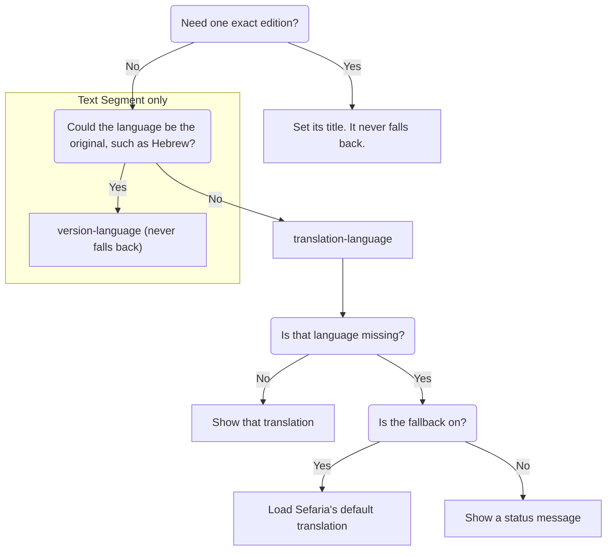

> Created/edited by GitHub Copilot; pending human review.

# Choose what text readers see

This page compares the content choices for [Text Segment](/use-components/show-text/show-one-passage.md), [Bilingual Segment](/use-components/show-text/hebrew-and-translation.md), [Source Card](/use-components/show-an-attributed-passage.md), and the Reader. It assumes that one of those components already works. If you don't, start with [Put your first source on a page](/use-components/start-here.md).

## Terms

Three terms matter throughout:

- An **edition** is one specific published text on Sefaria. Its title names it, such as `Bible du Rabbinat 1899 [fr]`.
- A **language** (or language family) is a group of editions, such as `french`. A language names many editions. A title names one.
- The **primary edition** is the one Sefaria marks primary for that text. It's usually the original, such as Hebrew.

A request is one call from the page to Sefaria. A dash in the tables means the component has no such attribute. The Reader also has attributes that aren't about text choice.

Each choice is an HTML attribute. You write it inside the tag.

## Two kinds of changes

- **Which text to load** is the language and edition. These change what the component requests, so a change makes a new request.
- **How it's shown** is vocalization, sides, arrangement, and the edition credit. These redraw text the component already has and never make a request.

## Choose which text to load

These choices change what the component requests.

<table>
  <thead>
    <tr>
      <th scope="col">You want to…</th>
      <th scope="col">Text Segment</th>
      <th scope="col">Bilingual Segment</th>
      <th scope="col">Source Card</th>
      <th scope="col">Reader</th>
    </tr>
  </thead>
  <tbody>
    <tr>
      <th scope="row">Show a translation in a language</th>
      <td colspan="4"><code>translation-language</code></td>
    </tr>
    <tr>
      <th scope="row">Show any edition in a language, including the original</th>
      <td><code>version-language</code></td>
      <td colspan="3">—</td>
    </tr>
    <tr>
      <th scope="row">Fall back when the language is missing</th>
      <td colspan="4"><code>translation-fallback</code> (<code>default</code> or <code>none</code>). Text Segment and Bilingual Segment default to <code>none</code>. Source Card and Reader default to <code>default</code>.</td>
    </tr>
    <tr>
      <th scope="row">Pin an exact edition</th>
      <td><code>version-title</code> (see Pin an exact edition)</td>
      <td colspan="3"><code>primary-version-title</code>, <code>translation-version-title</code></td>
    </tr>
  </tbody>
</table>

Every component takes `sref`. For the segments and Source Card, a fresh load makes one request. It makes two if the translation language is missing and `translation-fallback` is `default`. The Reader also loads the surrounding section and its links. Supplied data makes no request for the non-Reader elements. A Reader seed with only source data still makes one links request. See [Give components your own data](/data-and-text-tools/give-components-your-own-data.md).

### Choose a translation language

Set `translation-language` to a language name such as `french`. The value ignores case and outer spaces. All four components accept it. On Text Segment, it shows a translation instead of the primary edition, for example `<sefaria-text-segment sref="Micah 6:8" translation-language="french">`. It returns translations only. `version-language` can also return the original.

### When Sefaria doesn't have that language

The chart above shows where the fallback happens. Set it with `translation-fallback`: `default` or `none`.

Not every text has every translation. Ask for `french` on `Berakhot 2a:1`. Sefaria's response warns that French is missing. The setting decides what happens next.

- **`default`** is the default for Source Card and Reader. The component makes one more request for Sefaria's default translation. That translation isn't always English. Source Card and Reader show a notice such as `french is unavailable; showing english.` For the text operation, a fresh load makes two requests. The Reader repeats this for its surrounding section and also requests links.
- **`none`** is the default for Text Segment and Bilingual Segment. The component makes no second request. It shows the status message "No french text." This isn't an error. Text Segment is `empty`. Bilingual Segment and Source Card show the primary side with status `ready`.

| With fallback | What readers see | Requests |
| --- | --- | --- |
| `default` | Sefaria's default translation, with a notice on Source Card and Reader | One more request |
| `none` | The status message "No french text." | No second request |

With `default`, Text Segment and Bilingual Segment show the fallback text without a notice.

Only a bare language preference can fall back. An exact edition title never falls back, and an empty edition stays empty. In Bilingual Segment and Source Card, you can pin one side and give only a language for the translation. That translation can still fall back.

### Pin an exact edition

To avoid a fallback, pin one edition by its title. A title picks one edition, while a language picks any edition in that group.

| Choice | Picks | Can include the original | Falls back |
| --- | --- | --- | --- |
| `translation-language` | A translation in that language | No | Depends on `translation-fallback` |
| `version-language` | Any edition in that language | Yes | Never |
| Title attributes | One edition | Depends on the title | Never |

- Bilingual Segment and Source Card: `primary-version-title` pins the primary edition. `translation-version-title` pins the translation.
- Text Segment: `version-title` alone chooses another edition in the original language, such as a different Hebrew edition. To choose a translation by title, also set `translation-language`.

On Text Segment, `translation-language` and `version-language` are mutually exclusive. Pick one. `version-language` alone doesn't pin one edition.

## Choose how it's shown

These choices redraw text that has already arrived.

<table>
  <thead>
    <tr>
      <th scope="col">You want to…</th>
      <th scope="col">Text Segment</th>
      <th scope="col">Bilingual Segment</th>
      <th scope="col">Source Card</th>
      <th scope="col">Reader</th>
    </tr>
  </thead>
  <tbody>
    <tr>
      <th scope="row">Change Hebrew vowel marks and cantillation</th>
      <td colspan="4"><code>vocalization-mode</code></td>
    </tr>
    <tr>
      <th scope="row">Choose which sides show</th>
      <td>— (one side)</td>
      <td colspan="3"><code>content-language</code></td>
    </tr>
    <tr>
      <th scope="row">Arrange the sides</th>
      <td>—</td>
      <td colspan="3"><code>layout</code>, <code>side-order</code></td>
    </tr>
    <tr>
      <th scope="row">Hide the edition credit</th>
      <td colspan="2">—</td>
      <td colspan="2"><code>hide-attributions</code></td>
    </tr>
  </tbody>
</table>

On the Reader, `hide-attributions` and the side attributes apply to its source card.

Source Card also has `selectable`. Switching sides makes no request, because all three components with sides request both sides even when they show one. Source Card makes one text request for the whole card, however many verses it shows. It makes a second request only when the fallback applies.

### Set Hebrew vocalization

`vocalization-mode` controls the marks written with Hebrew letters. Hebrew text can carry vowel marks (nikkud) and cantillation marks (taamim). The default, `taamim_and_nikkud`, shows both. The other modes also remove related marks, such as the sof pasuq (׃). For exact behavior, see [Change vowels and cantillation](/data-and-text-tools/clean-up-stored-sefaria-text.md#change-vowels-and-cantillation).

| Value               | Hebrew shown                      |
| ------------------- | --------------------------------- |
| `taamim_and_nikkud` | Vowel marks and cantillation      |
| `nikkud`            | Vowel marks, without cantillation |
| `none`              | No vowel points or cantillation   |

All four components accept it.

### Choose the sides and their arrangement

Sides and arrangement apply to Bilingual Segment, Source Card, and Reader.

- `content-language` is `both`, `primary`, or `translation`. The default is `both`.
- `layout` is `auto`, `stacked`, or `side-by-side`. The default is `auto`.
- `side-order` is `primary-first` or `translation-first`. The default is `primary-first`.

Two columns appear only when both sides show. `side-order` changes the visual order only in two-column layouts.

## Try them together

<LiveEditor :code="textChoiceControls" title="Change the choices on a Source Card">Change the menus. Vocalization and sides redraw without a request. Choosing a translation language makes a new request. It makes two if Sefaria falls back.</LiveEditor>

## Edition credit and license

Only Source Card and Reader name the edition. They show each edition's title and language. They link the title to its source when Sefaria gives a valid http(s) address. They don't show the license. Text Segment and Bilingual Segment show only the text.

On Source Card, `hide-attributions` hides the credit and the fallback notice. It makes no request.

Generated client types include an optional `license` field in an edition's version metadata, but the components don't display it. Before you republish an edition, check its reuse rights. Look up its license, for example in the edition's details on Sefaria. This isn't legal advice.

Learn more: [Install and status](/help/install-and-status.md#license-and-text-rights) · [Sefaria's own texts and tools](/concepts/sefarias-own-texts-and-tools.md) {.learn-more}

## Clean up stored text

Vocalization changes only how text is shown. Cleaning stored text is a separate job for the text tools.

Learn more: [Clean up stored Sefaria text](/data-and-text-tools/clean-up-stored-sefaria-text.md) · [Reference › Text tools](/reference/text-transform.md) {.learn-more}

## Next steps

- Change how the components look with [Match your site's look](/across-components/match-your-sites-look.md).
- See the full examples in [Show one passage](/use-components/show-text/show-one-passage.md), [Show Hebrew and translation together](/use-components/show-text/hebrew-and-translation.md), and [Show an attributed passage](/use-components/show-an-attributed-passage.md).
- Look up every attribute in [Reference › Components](/reference/components.md), or read [Reference › Client](/reference/client.md) if you load text yourself.
