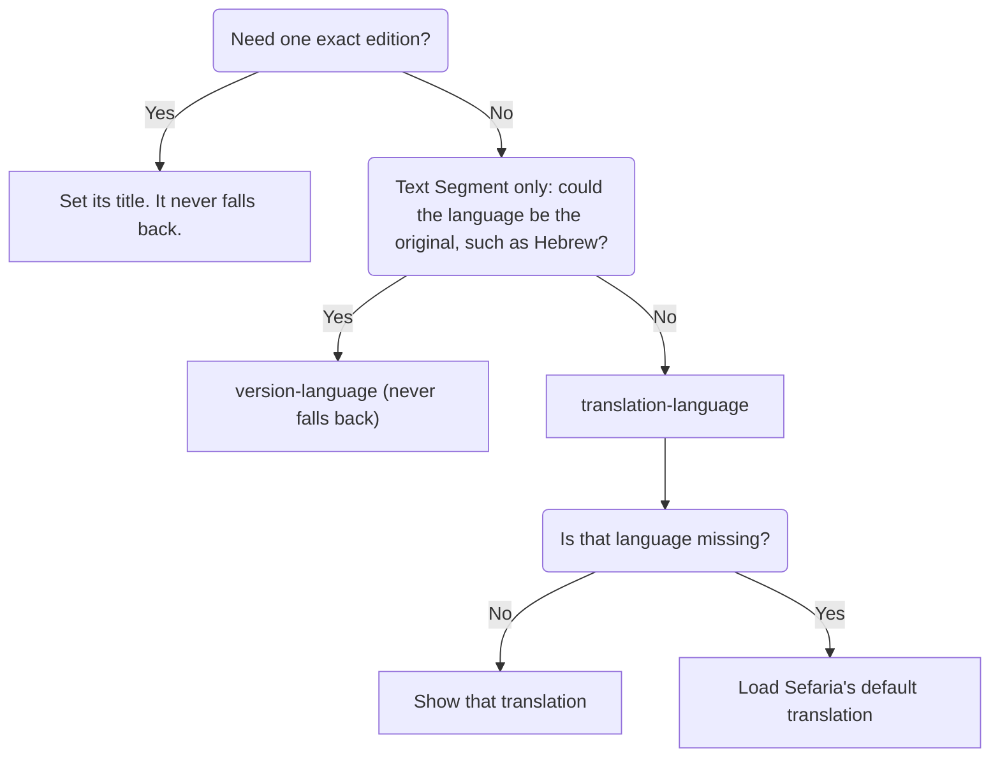

> Created/edited by GitHub Copilot; pending human review.

# Choose what text readers see

This page puts the content choices for [Text Segment](/use-components/show-text/show-one-passage.md), [Bilingual Segment](/use-components/show-text/hebrew-and-translation.md), and [Source Card](/use-components/show-an-attributed-passage.md), and the Reader side by side. This page assumes that you have one of those components working. If you don't, start with [Put your first source on a page](/use-components/start-here.md).

Each choice is an HTML attribute, a setting you write inside the tag. Choices come in two kinds:

- **Which text to load** is the language and edition. These change what the component requests, so a change makes a new request.
- **How it's shown** is vocalization, sides, arrangement, and the edition credit. These redraw text the component already has and never make a request.

A request is one call from the page to Sefaria. A dash in the tables means the component has no such attribute. The Reader also has attributes that aren't about text choice.

## Try them together

<LiveEditor :code="textChoiceControls" title="Change the choices on a Source Card">Change the menus. Vocalization and sides redraw without a request. Choosing a translation language makes a new request, or two if Sefaria falls back.</LiveEditor>

## Choose which text to load

- **Language could be the original:** `version-language` can't be combined with `translation-language`.
- **Preferred translation language:** After a fallback, Source Card and Reader show a notice, and the segments don't.

These choices change what the component requests.

<table>
  <thead>
    <tr>
      <th scope="col">You want to…</th>
      <th scope="col">Text Segment</th>
      <th scope="col">Bilingual Segment</th>
      <th scope="col">Source Card</th>
      <th scope="col">Reader</th>
    </tr>
  </thead>
  <tbody>
    <tr>
      <th scope="row">Show a translation in a language</th>
      <td colspan="4"><code>translation-language</code></td>
    </tr>
    <tr>
      <th scope="row">Show any edition in a language, including the original</th>
      <td><code>version-language</code></td>
      <td colspan="3">—</td>
    </tr>
    <tr>
      <th scope="row">Pin an exact edition</th>
      <td><code>version-title</code> (see Pin an exact edition)</td>
      <td colspan="3"><code>primary-version-title</code>, <code>translation-version-title</code></td>
    </tr>
  </tbody>
</table>

Every component takes `sref`. For the segments and Source Card, a fresh load makes one request, or two if a preferred translation language falls back. The Reader also loads the surrounding section and its links. A pinned edition doesn't fall back. Supplied data makes no request.

### Choose a translation language

The first choice is the language of the translation. Set `translation-language` to a language family name such as `french`. A family is Sefaria's grouping of editions by language. The value is trimmed and is not case sensitive. All four components accept it. On Text Segment, it shows a translation instead of the primary edition, for example `<sefaria-text-segment sref="Micah 6:8" translation-language="french">`. It returns translations only, never the original, while `version-language` can return the original.

### When Sefaria doesn't have that language

The chart at the top of this group shows where the fallback happens.

Not every text has every translation. Ask for `french` on `Berakhot 2a:1`. Sefaria's response warns that French is missing. Only then does the component make one more request for Sefaria's default translation. That translation isn't always English. Source Card and Reader show a notice such as `french is unavailable; showing english.` Text Segment and Bilingual Segment show the fallback text without a notice. That is two requests for a fresh load.

The fallback applies only to a bare language preference. Exact edition titles never fall back. An edition that exists but is empty stays empty. In Bilingual Segment and Source Card, if you pin one side's edition but give only a preferred language for the translation, that translation can still fall back.

### Pin an exact edition

To avoid a fallback, pin an exact edition. An edition title is the name Sefaria gives one edition, for example `Bible du Rabbinat 1899 [fr]`. Primary means the edition Sefaria marks primary. That is usually, but not always, the Hebrew or original.

- Bilingual Segment and Source Card: `primary-version-title` pins the primary edition. `translation-version-title` pins the translation.
- Text Segment has three cases:
  - `version-title` alone pins a primary edition by title. The default is the primary edition, not necessarily Hebrew.
  - `version-title` with `version-language` pins that title in that language.
  - `version-title` with `translation-language` requests that title in the preferred translation language.

On Text Segment, `translation-language` and `version-language` are mutually exclusive. Pick one. `version-language` alone shows any edition in that language family, including the original, with no fallback. It doesn't pin one edition.

## Choose how it's shown

These choices redraw text that has already arrived.

<table>
  <thead>
    <tr>
      <th scope="col">You want to…</th>
      <th scope="col">Text Segment</th>
      <th scope="col">Bilingual Segment</th>
      <th scope="col">Source Card</th>
      <th scope="col">Reader</th>
    </tr>
  </thead>
  <tbody>
    <tr>
      <th scope="row">Change Hebrew vowel marks and cantillation</th>
      <td colspan="4"><code>vocalization-mode</code></td>
    </tr>
    <tr>
      <th scope="row">Choose which sides show</th>
      <td>— (one side)</td>
      <td colspan="3"><code>content-language</code></td>
    </tr>
    <tr>
      <th scope="row">Arrange the sides</th>
      <td>—</td>
      <td colspan="3"><code>layout</code>, <code>side-order</code></td>
    </tr>
    <tr>
      <th scope="row">Hide the edition credit</th>
      <td colspan="2">—</td>
      <td colspan="2"><code>hide-attributions</code></td>
    </tr>
  </tbody>
</table>

Source Card also has `selectable`. Switching sides needs no new request, because Bilingual Segment and Source Card request both sides even when they show one. For a fresh load, Source Card makes one request for the whole card, however many verses it shows. Its verses make no requests of their own.

### Set Hebrew vocalization

Vocalization only changes how text is drawn. `vocalization-mode` controls the marks written with Hebrew letters. Hebrew text can carry vowel marks (nikkud) and cantillation marks (taamim). The default, `taamim_and_nikkud`, shows both. The other modes also remove a few related marks, such as the sof pasuq (׃). For the exact behavior, see [Change vowels and cantillation](/data-and-text-tools/clean-up-stored-sefaria-text.md#change-vowels-and-cantillation).

| Value               | Hebrew shown                      |
| ------------------- | --------------------------------- |
| `taamim_and_nikkud` | Vowel marks and cantillation      |
| `nikkud`            | Vowel marks, without cantillation |
| `none`              | No vowel points or cantillation   |

The component redraws text it already has, so this never makes a request. All four components accept it.

### Choose the sides and their arrangement

Sides and arrangement are two more display choices. They apply only to Bilingual Segment and Source Card, not Text Segment.

- `content-language` is `both`, `primary`, or `translation`. The default is `both`.
- `layout` is `auto`, `stacked`, or `side-by-side`. The default is `auto`.
- `side-order` is `primary-first` or `translation-first`. The default is `primary-first`.

Two columns appear only when both sides show. `side-order` changes the visual order only in two-column layouts.

### See which edition readers are shown

Only Source Card and Reader name the edition. It shows each edition's title and language, and links the title to its source when Sefaria gives a valid http(s) address. It doesn't show the license. Text Segment and Bilingual Segment show only the text.

On Source Card, `hide-attributions` hides the credit and the fallback notice. It makes no request.

Generated client types include an optional `license` field in an edition's version metadata, but the components don't display it. Before you republish an edition, check its reuse rights. Look up its license, for example in the edition's details on Sefaria. This isn't legal advice.

Learn more: [Install and status](/help/install-and-status.md#license-and-text-rights) · [Sefaria's own texts and tools](/concepts/sefarias-own-texts-and-tools.md) {.learn-more}

## Clean up stored text

Setting vocalization changes only how text is shown. Cleaning stored text is a separate job for the text tools.

Learn more: [Clean up stored Sefaria text](/data-and-text-tools/clean-up-stored-sefaria-text.md) · [Reference › Text tools](/reference/text-transform.md) {.learn-more}

## Next steps

- Change how the components look with [Match your site's look](/across-components/match-your-sites-look.md).
- See the full examples in [Show one passage](/use-components/show-text/show-one-passage.md), [Show Hebrew and translation together](/use-components/show-text/hebrew-and-translation.md), and [Show an attributed passage](/use-components/show-an-attributed-passage.md).
- Look up every attribute in [Reference › Components](/reference/components.md), or read [Reference › Client](/reference/client.md) if you load text yourself.
