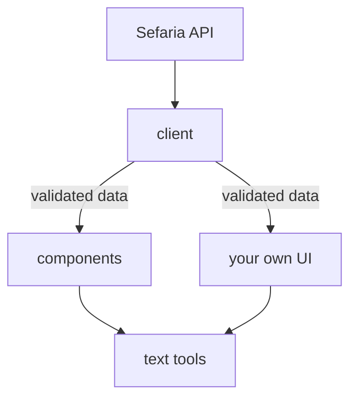

> Created/edited by GitHub Copilot; pending human review.

# How the toolkit works

Most surprises with the toolkit come from a few shared rules. This page explains them: when an element fetches, what its status means, how many requests to expect, why styles don't leak, and where the toolkit stops when you draw your own interface.

## The three packages

The toolkit is three packages. Two are independent building blocks, and the third uses both.

- `@arithmomaniac/sefaria-client` offers typed functions for Sefaria's API. It checks each JSON response against a schema before it returns the data.
- `@arithmomaniac/sefaria-text-transform` cleans Sefaria text. Its functions are `normalizeText`, `applyVocalization`, `applyVocalizationToHtml`, and `createTextPreview`. They work on strings and know nothing about the client.
- `@arithmomaniac/sefaria-web-components` provides six elements: Reference Label (`sefaria-ref-label`), Text Segment (`sefaria-text-segment`), Bilingual Segment (`sefaria-bilingual-segment`), Source Card (`sefaria-source-card`), Connections Panel (`sefaria-connections-panel`), and Reader (`sefaria-reader`). An element takes validated data from the client, or data you supply, and calls the text tools while it prepares text to show.

The client does not pass its responses through the text tools. Components call the text tools themselves, and so does your own code if you skip the components.

## When a component fetches

An element other than the Reader is eligible to load when it is on the page, has a non-blank `sref` (the Sefaria reference, such as Micah 6:8), and has no supplied `data`. It does not wait to scroll into view. It then uses its acquisition choice: the default client, your client, a host capability, or disabled. Disabled makes no request and shows an error.

Importing the script or the package fetches nothing. The shared default client is created lazily, the first time an element actually needs it.

You choose where data comes from with the `acquisition` property. `{ kind: "client", client }` uses a client you made. `{ kind: "capability", ... }` uses operations your host supplies. `{ kind: "disabled" }` turns loading off. The capability and disabled choices never fall back to the browser's own requests.

For the five elements other than the Reader, valid supplied `data` is authoritative. The element renders it and makes no request. Invalid supplied `data` shows an error. It does not quietly fall back to loading by `sref`.

The Reader also takes a `data` property, but its value is a seed (a `ReaderRawSeedData` object), not finished data. A seed holds at least one source or connections record, each with its payload and request details, plus an optional selected reference and presentation settings. A seed is a starting point, not a finished rendering. A source seed that already covers the passage continues with one links request and does not ask for the source again.

There is no server rendering or hydration of the components. They run in the browser.

Learn more: [Give components your own data](/data-and-text-tools/give-components-your-own-data.md) {.learn-more}

## Loading, ready, and error states {#status}

Every element has a `status` property with one of four values.

- `empty` means there is nothing to show. Either there is no input, or the data was prepared successfully and is empty.
- `loading` means the element is waiting for data or preparing it.
- `ready` means something is prepared to show. It may be partial.
- `error` means the request, the preparation, or the supplied data failed.

A failed later reload can keep the previous content on screen while the status is `error`. There is no generic ready or status-change event, so read `status` first when you need it.

Each element also has an error event named `sefaria-<element>-error`, such as `sefaria-source-card-error`. Its `detail` is `{ error, sref }`. The event bubbles and is composed, which means it crosses shadow boundaries (explained below).

For the five elements other than the Reader, the error event fires when a live load is rejected. A documented 400 or 404 answer from Sefaria, or invalid supplied data, sets `status` to `error` without firing the event. The Reader also fires it for a failed first load and an invalid seed. Some later Reader failures, such as connections that fail to load, show inside the Reader without the event. [Troubleshoot a page](/help/troubleshoot-a-page.md) matches each of these states to a fix.

The interaction events are separate. Source Card's `sefaria-source-select` bubbles and is composed, but it is not cancelable. The Connections Panel's and the Reader's interaction events are cancelable; their error events are not. The Connections Panel and the Reader already handle their own controls, such as category, page, and navigation. Your page can listen, or cancel with `preventDefault`. Source Card selection and Reader chat export are left to your page.

Learn more: [Component events](/reference/components.md#events) · [Make components respond to each other](/across-components/make-components-respond-to-each-other.md) {.learn-more}

## Request counts

Request counts are set per component. There is no single global rule. The invariant is that a child never repeats a request its parent already made.

These counts are for a normal first load with no cache hit. Cache hits or captured data can mean fewer network requests.

- Source Card makes one text request. Its Text Segment children add none, so ten children add zero requests.
- Source Card makes two requests in total when it needs one extra request for Sefaria's default translation, which is not always English. That happens only when Sefaria reports that the `translation-language` you asked for is missing.
- Connections Panel on its own makes one links request. Changing category or page makes none. In a standalone panel that loaded links without text, a preview request can reload the links once with text included.
- Reader loading Micah 6:8 makes three requests: the target text, the surrounding section text, and the links. With translation fallback it can make up to four text requests plus one links request. The Reader passes its data to its child Source Card and Connections Panel, and they make no requests of their own. That's typical for a single verse. A reference that is already a whole section, such as a chapter, skips the separate section request.

Each client also keeps a small in-memory response cache, so a repeat request can be answered without the network; see [The response cache](/concepts/the-client-and-sefarias-api.md#the-response-cache).

## Style isolation

Elements render inside shadow DOM. That is a browser feature that gives an element its own private tree of markup and styles. The elements are built with Lit, a small library for such elements. Because of the shadow DOM, your page CSS doesn't reach in by accident, and component CSS doesn't leak out.

You style them through custom properties, which are CSS variables that cross the shadow boundary. Examples are `--sefaria-surface`, `--sefaria-fg`, `--sefaria-accent`, `--sefaria-link`, and `--sefaria-panel-radius`.

The defaults use CSS `light-dark()`. They follow the system's light or dark setting only when your page declares `color-scheme: light dark`. Setting `light` or `dark` forces one. Reader also exposes `::part(toolbar)`, `::part(history)`, `::part(source-pane)`, and `::part(connections-pane)` for targeted styling.

Learn more: [Match your site's look](/across-components/match-your-sites-look.md) {.learn-more}

## Using the client and text tools without components {#without-components}

You can use the client and the text tools without any element. Some value stays with you.

From the client you still get typed, validated data and typed errors. A response that doesn't match the schema raises `SefariaContractError`. From the text tools, `normalizeText` returns safe `bodyHtml` plus the footnotes it extracted (`notes`). It keeps a fixed set of elements and removes active attributes such as `href` and `src`. Reference links that carry Sefaria's reference data become inert markers with `data-sefaria-ref`; other links become plain text.

The vocalization functions are narrower. `applyVocalization` and `applyVocalizationToHtml` change vowel marks but don't sanitize. The HTML version expects HTML that is already normalized. `createTextPreview` calls `normalizeText` itself.

Your renderer owns everything else:

- layout
- accessibility and keyboard behavior
- showing attribution
- loading states and errors
- inserting only normalized HTML, never raw Sefaria HTML

For the details, see [Handle errors in your code](/data-and-text-tools/handle-errors-in-your-code.md), [Clean up stored Sefaria text](/data-and-text-tools/clean-up-stored-sefaria-text.md), and [Clean text and safety](/concepts/clean-text-and-safety.md). [Sefaria's own texts and tools](/concepts/sefarias-own-texts-and-tools.md) explains references and editions.

Learn more: [Client reference](/reference/client.md) · [Text tools reference](/reference/text-transform.md) {.learn-more}
