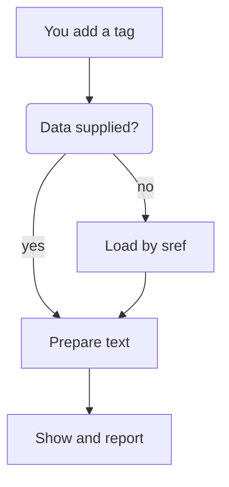

> Created/edited by GitHub Copilot; pending human review.

# How the toolkit works

The easiest way to see how the toolkit fits together is to follow one tag from your page to the screen. This page follows `<sefaria-source-card sref="Micah 6:8">` and explains, at each step, why the toolkit behaves as it does.

## You add a tag

You put the tag on your page. Behind it sit three packages. The client (`@arithmomaniac/sefaria-client`) fetches from Sefaria's API and checks each JSON response against a schema. The text tools (`@arithmomaniac/sefaria-text-transform`) clean text strings and know nothing about the client. The components (`@arithmomaniac/sefaria-web-components`) use both. The elements are standard web components built with [Lit](https://lit.dev).

Importing the script or the package registers the elements but makes no request of its own. Any tag already on the page with an `sref` then loads as usual. The shared default client is created lazily, the first time an element needs it. Nothing renders on the server. The components run in the browser.

With the tag in place, the element needs text to show. The next step is where that text comes from.

## Where the text comes from

The element has three possible sources:

- live loading by `sref`, through the default client or a client you supply
- `data` you supply, on the Text Segment, Bilingual Segment, and Source Card only
- a capability your host provides

If you disable loading, the element makes no request. It shows an error only when it needed to load. Supplied data still renders, and a tag with no input stays empty.

On those three elements, supplied `data` wins over `sref`. You already have the text, so asking Sefaria again would waste a request and could disagree with what you gave. For the same reason, invalid `data` shows an error and does not fall back to `sref`. A silent fallback would hide your bug and show text you didn't choose.

The Reader and Connections Panel don't take `data`. To give them local data, your host provides an acquisition capability. See [Give components your own data](/data-and-text-tools/give-components-your-own-data.md) for supplying data and host capabilities, and [the Components reference](/reference/components.md) for exact property shapes.

When the text comes from `sref`, the element has to ask Sefaria for it.

## Asking Sefaria

Two elements are composed of other elements. The Source Card shows a heading and draws its text with Text Segments inside it, and the Reader shows a Source Card and a Connections Panel. A composed element fetches the text once and hands it to the elements inside it. Nesting them doesn't cost extra loading.

The other elements load their own data when you use them on their own. Those are the Text Segment, Bilingual Segment, and Connections Panel. For how the client handles requests, including its cache, see [The client and Sefaria's API](/concepts/the-client-and-sefarias-api.md).

Once the response arrives, the text still needs preparing.

## Preparing the text

The text is HTML with Sefaria's own markup, so the component doesn't draw it as it arrives. It runs it through the text tools first. `normalizeText` keeps a fixed set of safe elements and removes active attributes. That step is where safety comes from. Then the element applies vocalization. Only then does the element show the text. See [Clean text and safety](/concepts/clean-text-and-safety.md).

Once the text is prepared, the element can show it and tell your page how it went.

## Reporting back {#status}

The element reports through its `status` property, a coarse, element-level summary:

- `empty`: no main content was prepared, either because there is no input or because the data was prepared successfully and is empty. An empty-state message may still show.
- `loading`: the element is waiting for data or preparing it.
- `ready`: something is prepared to show, and it may be partial.
- `error`: the request, the preparation, or the supplied data failed. A failed later reload can keep the old content on screen while the status is `error`.

The Reader's status covers its main passage. Its connections can still be loading or unavailable while it is `ready`.

An element can finish before your script listens. So it keeps its state in `status` instead of firing a one-time ready event you could miss.

Each element also has an error event named `sefaria-<element>-error` for particular failures, such as a failed request. The element may show the same error on the page too. Not every error fires the event.

Some elements send interaction events that your page can listen to. Examples are a Source Card selection or a Connections Panel category change. See [Troubleshoot a page](/help/troubleshoot-a-page.md), [Component events](/reference/components.md#events), and [Make components respond to each other](/across-components/make-components-respond-to-each-other.md).

## Using the client and text tools without components {#without-components}

You can also take all these steps yourself, without components. They are the same steps, now yours.

You fetch with the client. It gives typed, validated data and typed errors. A response that doesn't match the schema raises `SefariaContractError`.

You prepare with the text tools. `normalizeText` returns safe `bodyHtml` plus the footnotes it extracted (`notes`). `applyVocalization` and `applyVocalizationToHtml` change vowel marks but don't sanitize, so normalize first. `createTextPreview` normalizes itself.

Then you show the text and report status yourself.

When you draw it yourself, you own:

- layout
- accessibility and keyboard behavior
- showing attribution
- loading states and errors
- inserting only normalized HTML

For details, see [Handle errors in your code](/data-and-text-tools/handle-errors-in-your-code.md) and [Clean up stored Sefaria text](/data-and-text-tools/clean-up-stored-sefaria-text.md). [Sefaria's own texts and tools](/concepts/sefarias-own-texts-and-tools.md) explains references and editions.

Learn more: [Client reference](/reference/client.md) · [Text tools reference](/reference/text-transform.md) {.learn-more}

## Where to go next

To change how the components look, see [Match your site's look](/across-components/match-your-sites-look.md).
