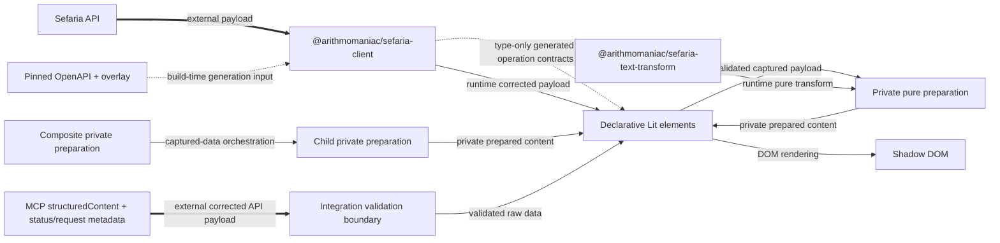

> Created/edited by GitHub Copilot; pending human review.

# Design: Generated API Contracts and Declarative Components

For a first explanation with examples, read [How the pieces fit together](guides/data-flow.md). This document is the ownership and dependency reference.

## Summary

This design defines a generated API foundation with corrections and declarative components that accept `sref` or validated raw `data`. The standalone-loading boundary is implemented. Public elements accept declarative references or component-specific raw input, while prepared rendering remains private.

## Scope

**In scope:** the Sefaria OpenAPI supply chain, the thin public client, text processing, private component preparation, declarative standalone elements, the MCP payload boundary, and authored citation-popup integration.

**Out of scope:** a generalized domain-model package and offline reference parsing without a concrete consumer. Cache persistence, stale fallback, retries, request coalescing, HTML server rendering, and hydration are also out of scope.

## Core scope

Core is the stable first product boundary. It is not a delivery phase or issue plan.

Core includes the eight API operations, all three text-processing capabilities, the text primitives, the source card with its bounded text collection, the popup, the authored linked-article demonstration, and the MCP source-card App. The generated citation-detection submission and task-status operations remain transport capabilities; the maintained linked-article integration does not run an automatic detector. See [Development](development.md) for current implementation details.

The connections panel, standalone contextual reader, DOM-free Reader session, standalone Reader, and regular-website Reader workspace are implemented outside Core. The completed cutover places ordinary request execution and cancellation in the public elements while the session retains bounded semantic history and capture ownership. The website workspace separately demonstrates lower-level spatial pane ownership.

## Source authority

The repository specifications define intended behavior. The [pinned Sefaria OpenAPI document](https://github.com/Sefaria/Sefaria-Project/blob/1f7d0844ca6a9eddc8e48168962aacb09de75bd6/docs/openAPI.json), original endpoint implementation, upstream tests, and deployed fixtures provide evidence.

The pinned OpenAPI input plus guarded overlay is the machine-readable authority for transport payloads. Generated declarations are the field-level reference for those payloads.

Each component's private validated preparation is the authority for rendered data state. Public raw data and corrected transport payloads are not render-ready state.

If evidence conflicts with a specification, record the observation in [evidence.md](evidence.md). Then change the owning specification or its reviewed overlay before production code.

Each OpenAPI correction starts with the original Sefaria route, handler, response builder, and endpoint tests at the pinned commit. A deployed fixture confirms runtime behavior when the source permits more than one shape.

## Requirements

- The ordinary build must generate all API artifacts without network access.
- Every overlay correction must assert its expected old state at an exact JSON path.
- Public client calls must preserve generated-client and Fetch API success and failure semantics.
- Every public element must accept `sref`, component-specific raw `data`, and only its documented acquisition, visual, and interaction properties.
- Defined non-Reader `data` must suppress acquisition, including valid empty and invalid input.
- Supplied and acquired paths must converge on equal private preparation for the same captured payload and deterministic options.
- A composite that produces ten child renderings from one response must make one request and zero child requests.
- Unknown JSON must fail with structured paths before component projection.

## Boundary summary

| Concern | Boundary |
| --- | --- |
| Transport contracts | Pinned OpenAPI input, guarded overlay, and generated declarations |
| Client | Thin configured `@hey-api/client-fetch` capability with a configurable base URL, injectable `fetch`, and bounded per-client response cache |
| Public API data | Generated API contracts consumed directly |
| Component data | Component-specific raw inputs plus private prepared rendering state |
| Element input | `sref`, raw `data`, tagged acquisition choice, and visual or interaction properties |
| Request ownership | Element-owned lifecycle using a per-element source or one module-local lazy default |
| Reader history | DOM-free reader session over semantic entries and immutable raw retained records |
| Server-provided data | Corrected API-shaped JSON, validation, and the same private preparation |
| Reference operations | Generated API contracts and component-owned acquisition |

## Ownership

| Owner | Responsibility | Must not own |
| --- | --- | --- |
| `@arithmomaniac/sefaria-client` | Pinned OpenAPI input, checksum, guarded overlay, generated contracts, Zod schemas, TypeScript validators, thin client, and bounded per-client response cache | Rendering, component view models, persistent or shared caches, retries, coalescing, stale fallback, or component methods |
| `@arithmomaniac/sefaria-text-transform` | Pure sanitization, vocalization, and footnote operations | Requests, DOM rendering, or API contract correction |
| Non-DOM `@arithmomaniac/sefaria-web-components` subpaths | Public raw input and acquisition types, shared raw Reader source qualification, and the advanced Reader semantic/raw facade | A generalized domain facade, retries, coalescing, stale fallback, persistence, or public prepared rendering types |
| `@arithmomaniac/sefaria-web-components/acquisition` | Module-local lazy default configuration and tagged client/host-capability/disabled choices | Global registries, fallback after explicit choice, another response cache, or client mutation |
| `@arithmomaniac/sefaria-web-components/reader-session` | Supported advanced semantic/raw facade: immutable history, raw transitions, transactional root replacement, stable raw records, entry information, budgets, completion eligibility, presentation, and pins | Prepared rendering/content, browser-default transport, persistence, DOM state, or spatial pane placement |
| `@arithmomaniac/sefaria-web-components` elements | Reactive input snapshots, acquisition, cancellation, stale suppression, private preparation, layout, interaction, accessibility, theming, DOM rendering, and documented bounded slots or coarse CSS parts | Arbitrary fetch functions, base URLs, untyped hosts, public prepared-state inputs, retries, fallback transport, or private-child part forwarding |
| Package manifests and generated metadata | Built JavaScript/declaration export maps, tarball contents, custom-elements metadata, and declaration-derived public export inventory | Source aliases, registry publication, or alternate component contracts |
| Repository integration policy | Active runtime/build path inventory, private manifests, built exports, CI permissions, portable lockfile resolution, maintained documentation claims, and old-to-new test disposition | Product contracts, publication, deployment, or historical-source censorship |
| Website reader demonstrations | The standalone page assigns `sref` to one persistent Reader; the workspace page owns lower-level session coordination, pane placement, pane pin lifetime, compact selection, and spatial descendant pruning | Public arbitrary-panel contracts or duplicate semantic history |
| Integrations | Tool input, activation policy, external boundary validation, optional source creation, and application-specific coordination | A second domain model, public prepared-state construction, duplicate rendering, or hidden fallback transport |
| Specifications | Intended behavior and acceptance rules | Mutable issue state |
| `docs/evidence.md` | Observed source and deployed behavior | Normative product contracts |

## Package dependency diagram

Solid arrows show runtime dependencies. Dotted arrows show build-time or type-only dependencies as labeled. Labeled orchestration arrows show private preparation and parent-owned composition. Thick arrows show external payload boundaries.

## OpenAPI supply chain

`@arithmomaniac/sefaria-client` owns one committed upstream OpenAPI input from Sefaria commit `1f7d0844ca6a9eddc8e48168962aacb09de75bd6`. A committed checksum makes accidental input changes visible.

An explicit refresh operation can access the network. Ordinary generation reads only committed files.

The deterministic overlay records reviewed Core corrections. Each change identifies a JSON Pointer, the expected old value or absence, and the corrected value.

If an assertion fails, generation stops at that JSON path and reports the expected and actual state. The overlay never applies a best-effort correction.

The temporary corrected document generates TypeScript `paths`, `components`, operation types, Zod schemas, and runtime validators.

Checks regenerate these outputs and fail if the worktree differs. Stale generated output cannot pass the repository check.

See the [client specification](specs/client.md) for endpoint and failure contracts.

## Client boundary

The public client is a thin configured `@hey-api/client-fetch` capability. Its options include a base URL and an injectable `fetch`.

The client exposes generated GET and POST operation contracts from the corrected schema. It does not add a generalized normalized facade.

Documented HTTP failures remain typed error payloads from the generated client. Network failures and aborts preserve Fetch API rejection behavior.

The client validates every JSON response against the generated schema for its operation and status.

A contract mismatch rejects the operation with the operation identifier, response status, structured JSON paths, and original `Response` metadata.

Unknown inputs from MCP or another external boundary receive validation before component projection.

## Component boundary

Each public component subpath owns its raw input forms, selection/options types, events, diagnostics, and element class. Preparation types and helpers remain private. The root entry registers all seven custom elements. The DOM-free `./acquisition` entry owns tagged source choices and shared-default configuration. The completed cutover retired `./bindings` and `./reader-controller`.

The `reader-session` subpath remains a supported advanced DOM-free semantic/raw facade. It exposes history, pins, budgets, `entryInfo`, stable source/connections raw records, and raw transitions needed by spatial hosts. It does not expose prepared child rendering or content. The `reader` subpath exposes the shared raw source-qualification boundary used by both the ordinary Reader element and spatial hosts.

A composite can resolve a child input by payload role before private preparation. Shared private helpers prevent repeated transformation logic without exposing a prepared public type.

The source card owns the bounded text collection. Segment, flat range, chapter, spanning range, and nested non-spanning payloads use one composite contract; there is no separate text-range element or factory. Card items retain positional identity. Selectable single-section items use a component-owned metadata-backed address mapper, not arbitrary array-index reference synthesis.

Request warnings remain with the selector-owning factory or composite. A resolved-version projection cannot assign a warning for another request selector.

Raw HTML can enter private preparation only as a field of validated raw data. Preparation uses `@arithmomaniac/sefaria-text-transform` to normalize safety and structure once before constructing private render state. Safe `bodyHtml` and source-ordered note records stay together; normalized HTML is not fed back through the raw-data path.

Public data state enters through component-specific raw contracts. The element accepts no arbitrary `fetch`, base URL, untyped host, or public prepared rendering value. It owns acquisition eligibility, private preparation, layout, theme, vocalization display, focus behavior, and other interaction state.

Bounded customization remains rendering-only. Shared `--sefaria-*` custom properties and typed presentation properties are the default surface. A named optional slot can admit additive host-owned controls when a maintained consumer needs placement inside an element, but it does not supply data or replace required content. Coarse CSS parts can expose stable outer regions; child internals remain encapsulated unless a separately evidenced public alias is declared. The generated custom-elements manifest records slots and parts from source declarations only when build-time template evidence matches them exactly.

See the [component specification](specs/components.md) for the three-layer contract and composition rules.

## Interactive task ownership

An element emits a composed event when a user action requests different data. The event describes the action and target. It does not expose a client or raw payload. The current unprevented owner executes the default once after verifying that the originating state remains current.

The host owns the explicit activation that permits the first live request on maintained pages. Opening a live route or reference deep link only prefills host input; it does not start data loading. After activation, the element owns its ordinary acquisition lifecycle. The Reader session owns committed semantic selection, history, capture retention, and stable completion eligibility. A lower-level host can coordinate the session directly when it needs spatial state outside the ordinary Reader contract.

The host can use authoritative captured data, validated server-provided data, or a tagged client/host capability. Captured and server-provided data enter through `data`; acquisition sources enter through the documented source property.

The captured-data owner declares which targets the payload covers. An empty prepared result does not prove that the payload covered the target.

Connections retains one corrected links response with exact request and status coverage for local paging. The Reader session generalizes capture ownership only across its bounded retained history: captures retain exact coverage and are released when no retained entry references them.

If the host has no permitted data source, the integration shows its unavailable state outside the target element. It must not construct an unsupported component state.

The host must not create a second rendering-state owner for the same surface. Application state may choose inputs, activation, and source policy, but the target element owns its loading and terminal presentation.

## Server and client convergence

Client mode lets the element call one generated operation through its selected acquisition source, validate the corrected result, and pass the captured payload to private preparation.

Server-provided mode receives corrected API-shaped JSON at an unknown boundary. The JSON must pass the generated runtime validator before assignment as raw `data`; the element then uses the same private preparation.

Server-provided mode does not return component HTML. The architecture has no HTML server rendering or hydration contract.

## Composite request rule

A composite element owns its outer request. After that request, it prepares child rendering from slices of the captured payload.

It must not assign child `sref` or trigger child acquisition. Ten child renderings from one composite response mean one outer request and zero child requests.

## MCP boundary

MCP `structuredContent` carries a corrected API payload. Namespaced tool-result metadata carries the exact request reference and documented response status so the App can select the generated schema and construct a raw Reader seed. The metadata carries no duplicated payload fields or prepared rendering state. The MCP server role owns Sefaria requests whether a Node transport or the trusted browser-embedded reference host executes it; the sandboxed App and elements never fall back to direct Sefaria HTTP.

## Failure contracts

| Boundary | Required failure |
| --- | --- |
| Pinned input | A checksum mismatch stops generation before overlay application |
| Overlay | A stale assertion reports the exact JSON path, expected state, and actual state |
| Generated output | A repository check fails when regeneration changes a committed file |
| Documented HTTP error | The client returns the generated typed error payload and response metadata |
| Network or abort failure | The client preserves the rejected Fetch API operation |
| Response contract mismatch | The client rejects with the operation, status, structured paths, and response metadata |
| External unknown JSON | Validation reports structured paths before projection |
| Missing requested content | Private preparation produces the component-specific partial or empty state |
| Deterministic preparation | The same payload and deterministic inputs produce equal prepared rendering |
| Composite preparation | Children receive captured parent data and make no request |
| Explicit source failure | The element reports the current failure without fallback transport |

## Text processing

`@arithmomaniac/sefaria-text-transform` owns pure sanitization, vocalization, footnote processing, and the HTML parsing these operations require. It does not own API shapes or private component rendering state. Component preparation must not duplicate its parser. See the [text-processing specification](specs/text-processing.md).

## Integrations

The linked-article demonstration consumes public contracts and built artifacts. Its article author supplies ordinary Sefaria anchors. The page owns eligible activation, Popup `sref` assignment/clearing, visible host limitations, and cleanup. It does not extract article text, submit citation detection, poll tasks, bulk preload, or rewrite the host DOM.

The MCP App validates its namespaced request/status metadata and corrected API-shaped JSON before raw seed admission. The generated find-refs and async-task operations remain available transport operations, not an active automatic-Linker workflow in this repository.

See the [integration specification](specs/integrations.md).

## Non-goals

This repository does not replace the Sefaria reader, mobile app, Linker, or MCP server. Outside the bounded local reader session, it does not define accounts, durable reading history, sheets, search, topics, restricted content, telemetry, hosting, or publication policy.

Correct text, direction, sanitization, attribution, and accessible interaction have priority over pixel parity.

## Current tooling and future names

The client implementation has selected its generator, Zod validators, and committed artifact paths. [Development](development.md#openapi-workflow) records the current tools and workflow. These choices must continue to satisfy the offline, deterministic, and stale-output contracts.

The text-segment, bilingual-segment, reference-label, source-card, popup, connections-panel, Reader, Reader-session, and acquisition entry names are current. Unrelated future component slices and broader compatibility work remain planned where identified in Development.
