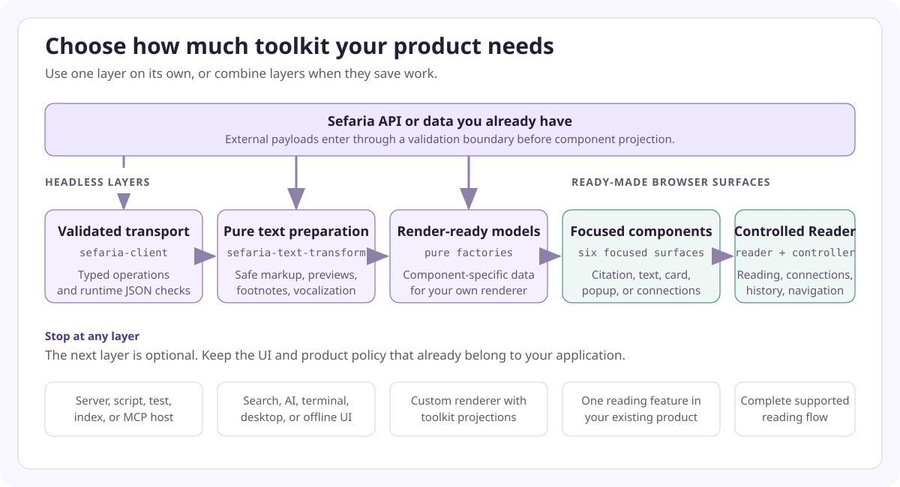

> Created/edited by GitHub Copilot; pending human review.

# Get started

Start with the job that your product needs, not with the largest package. The toolkit has independently useful layers: validated Sefaria transport data, pure text preparation, render-ready view models and controllers, focused request-free components, and a complete controlled Reader. You can stop at any layer.

<picture>
  <source media="(max-width: 640px)" srcset="./images/integration-depths-mobile.svg">
  
</picture>

The arrows show ways to combine layers, not mandatory steps. A server can stop after validated transport. A search or AI pipeline can use only text preparation. A custom application can render factory output itself. Browser products can add one focused component or the complete controlled Reader.

| Your product needs | Start here |
| --- | --- |
| Validated Sefaria responses for a server, script, browser app, test, or MCP host | `@arithmomaniac/sefaria-client` |
| Safe text HTML, bounded previews, footnotes, or vocalization changes over data you already have | `@arithmomaniac/sefaria-text-transform` |
| Component-specific rendering data for your own UI | A pure factory from a non-DOM `@arithmomaniac/sefaria-web-components/*` subpath |
| One citation, segment, passage card, popup, or connections view | A focused Web Component |
| Reading, connections, commentary navigation, and semantic history | The controlled Reader |

Headless means that no browser element is registered.

## Use the client without components

Use `@arithmomaniac/sefaria-client` when your application wants supported Sefaria transport data but owns its own processing and presentation. The client is the runtime-validation boundary; it does not register elements or create component view models.

```ts
import { createSefariaClient, getV3Texts } from "@arithmomaniac/sefaria-client";

const client = createSefariaClient();

export function loadValidatedText(tref: string) {
  return getV3Texts({
    client,
    path: { tref },
  });
}
```

`loadValidatedText` is the transport boundary that a server endpoint, search or indexing job, MCP tool, test harness, or custom application can call. Its returned value is validated against the operation and status contract before the application stores, transforms, or renders it. Documented HTTP errors remain typed response payloads. Invalid JSON, undocumented statuses, network failures, and aborts do not become empty or successful data. Continue with the [client package reference](https://github.com/Arithmomaniac/sefaria-frontend-toolkit/blob/main/packages/client/README.md) for the generated operations, schemas, validators, and error behavior.

## Use text transforms without the client

Use `@arithmomaniac/sefaria-text-transform` when text has already arrived through an API, server, fixture, stored record, or user-controlled boundary. Its operations are deterministic and DOM-free; they do not fetch data or register custom elements.

```ts
import { createTextPreview } from "@arithmomaniac/sefaria-text-transform";

export function prepareSearchPreview(apiHtml: string) {
  return createTextPreview(apiHtml, 3500);
}
```

The result contains bounded safe HTML, decoded visible text, and a truncation flag. The same package sanitizes reviewed Sefaria markup, extracts footnotes, and applies the three current vocalization modes. These operations fit search indexing, AI input preparation, terminal or desktop presentation, offline data, and any product that already has a renderer. Read the [text-transform package guide](https://github.com/Arithmomaniac/sefaria-frontend-toolkit/blob/main/packages/text-transform/README.md) and [text-markup guide](guides/text-markup.md) for exact contracts.

## Use factories with your own renderer

A pure component factory turns validated API-shaped JSON into rendering data without making a request or registering an element. Use this path when your application wants the toolkit's component-specific projection but will render the result in its own UI.

```ts
import { zGetV3TextsResponse } from "@arithmomaniac/sefaria-client/schemas";
import {
  createSourceCardViewModel,
  type SourceCardRequest,
} from "@arithmomaniac/sefaria-web-components/source-card";

export function projectReceivedText(
  value: unknown,
  request: SourceCardRequest,
) {
  const payload = zGetV3TextsResponse.parse(value);
  return createSourceCardViewModel(payload, request);
}
```

The caller must provide a request that matches the captured payload. The factory is not an offline reference parser and does not find a different passage inside unrelated data. The returned view model can go to a toolkit element or to application-owned rendering code.

A view model is data that a component renders. A factory prepares API data for a component. Pure factories require validated API-shaped JSON and do not make requests.

## Add a focused component

Use the [component catalog](components.md) when the product needs one reference label, selected text segment, bilingual segment, passage card, popup, or connections panel. Start with a source card when a passage needs its heading, selected editions, text, and attribution.

1. Validate supplied JSON or create the client that loads it.
2. Call the component's pure factory, async factory, or optional controller.
3. Assign or bind the returned view model to the request-free element.
4. Listen for semantic events when the component allows interaction.

The [supplied-data lesson](learn/02-supplied-data.md) includes an inline HTML, CSS, and JavaScript editor with no request. The [live-data lesson](learn/03-live-data.md) contrasts that project with a separate live host that adds loading, cancellation, visible failures, and protection from old results.

## Build a complete Reader

Use this path when users need to read bilingual text, open connections, follow commentary, and return through their history.

1. [Run the controlled Reader](learn/04-reader.md#try-it).
2. Create one `@arithmomaniac/sefaria-client` client in your application.
3. Load the supplied Reader controller for a bounded reference such as `Micah 6:8`.
4. Bind the controller to `<sefaria-reader>`.
5. Dispose the binding and controller when your application removes the Reader.

A host is the application that owns the component. The controller manages Reader state changes and cancels requests. The element renders accessible content and sends interaction events. The host owns the starting reference, client, placement, and cleanup.

<SiteLink to="/examples/reader/controlled.html?tref=Micah%206%3A8">Open the controlled Reader preview</SiteLink>

## Installation status

Public package installation is planned for release. Until then, evaluate the [interactive examples](examples.md) without installing packages, or use the repository-only [private package setup](https://github.com/Arithmomaniac/sefaria-frontend-toolkit/blob/main/docs/development.md#build-and-pack-the-private-libraries) for integration qualification.

If a component, editor, Reader, or live operation behaves unexpectedly, start with the symptom-led [troubleshooting guide](guides/troubleshooting.md) before changing package, request, or browser policy.

Clone the source only to change the toolkit or run its complete validation. Contributor setup and commands remain in the repository [Development guide](https://github.com/Arithmomaniac/sefaria-frontend-toolkit/blob/main/docs/development.md).

## Continue

- [Choose a component](components.md)
- [Learn step by step](learn/01-web-components.md)
- [See runnable examples](examples.md)
- [Read task-focused guides](guides/index.md)
