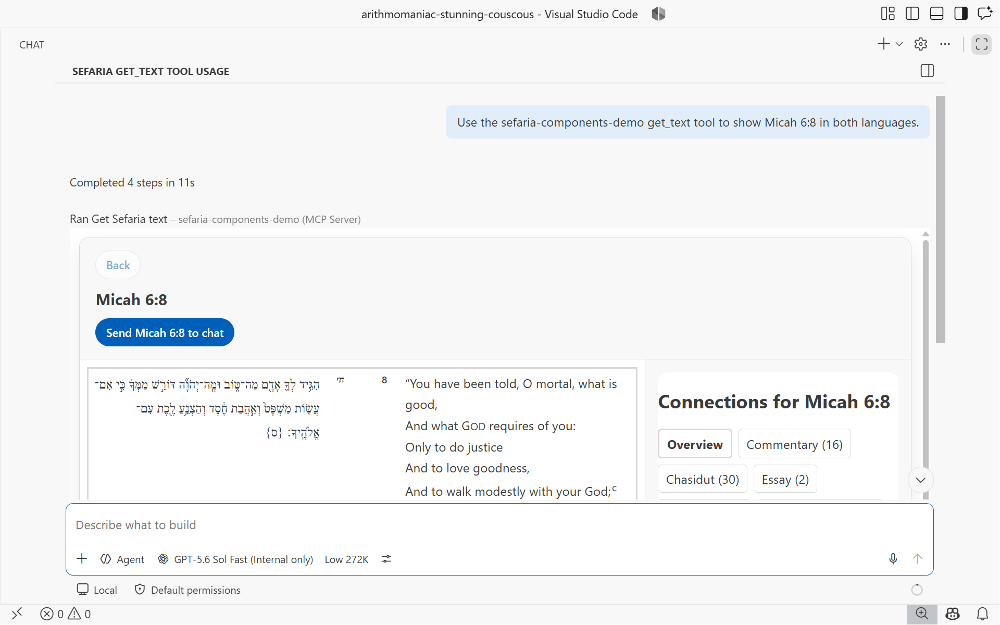
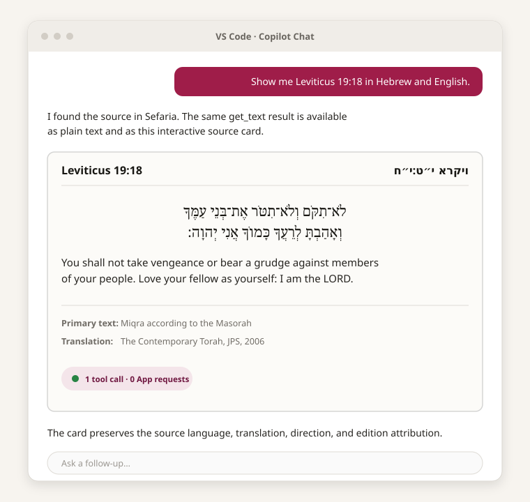
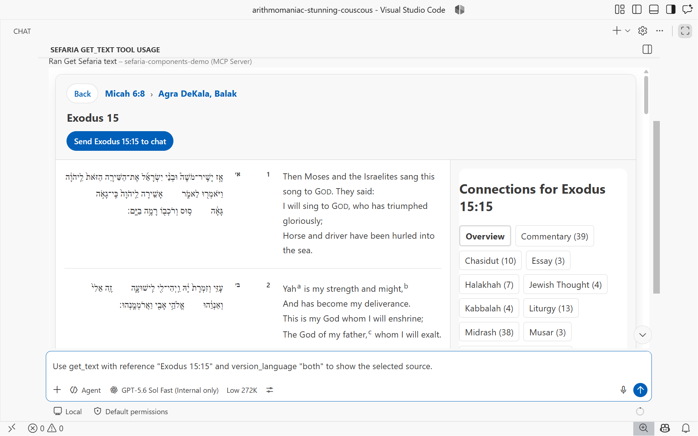
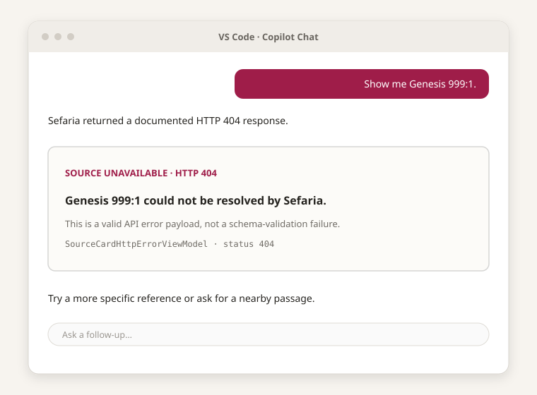
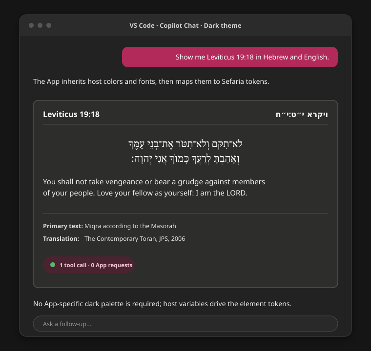

> Created/edited by GitHub Copilot; pending human review.

# MCP App demonstration

## What it demonstrates

One initial `get_text` result creates the stateful Reader. The same App can load connections, follow connection hops, retain breadcrumb history, restore earlier entries locally, and export the selected reference to chat.

## Try the static live host

Open the <SiteLink to="/examples/mcp-app/live.html">live MCP App host</SiteLink>. The page is fully static: it does not require a deployed server, proxy, account, or second hosted origin. It also makes no Sefaria request until you select **Start live demo**.

After activation, the trusted page creates a real MCP client and server, connects them with the pinned SDK's in-memory transport, reads the packaged App through `resources/read`, and renders it through AppBridge in an opaque-origin sandbox. The MCP server role makes the live Sefaria requests; the packaged App uses host-mediated MCP tools and cannot fetch Sefaria directly.

This route demonstrates the packaged resource, in-browser MCP exchange, AppBridge continuation, request ownership, and static sandbox topology. Repository contributors can use the repository-only [MCP development and named-host instructions](https://github.com/Arithmomaniac/sefaria-frontend-toolkit/blob/main/docs/development.md#run-the-mcp-app-server) for stdio, Streamable HTTP, and VS Code paths.

## Reader interaction

The initiating host calls `get_text` once. The MCP server role fetches one corrected Sefaria v3 texts payload and returns plain text for every host plus `structuredContent` and the App resource for MCP Apps hosts. That role runs in Node for stdio and Streamable HTTP or in the trusted page for the static live host. The App validates the result, admits reader source content, creates one reader controller with zero initial requests, and binds one persistent request-free `<sefaria-reader>`.

The controller then calls bare `get_links_between_texts` through the host's `serverTools` capability. Source and connections remain in the same App frame. Category switching and paging reproject retained links locally. Selecting a connection performs bounded source qualification through bare `get_text`, loads that target's connections, and appends one reader history entry.

Breadcrumb activation is local retained-history projection. The walkthrough restores the middle entry and then the Micah 6:8 root without creating another chat turn.

## Chat export

Send to chat is an explicit action separate from reader data transport. It sends one fixed `ui/message` request containing the exact current selected reference. The App rejects stale exports, suppresses concurrent sends, and does not retry unconfirmed delivery.

## Invalid payload

Invalid corrected API-shaped JSON stops before component projection. The integration-owned error state lists structured JSON paths and does not make a fallback request.

## Documented HTTP error

A validated documented 400 or 404 payload becomes `SourceCardHttpErrorViewModel`. It is not mislabeled as an unknown-boundary validation failure.

## Host theme

The App applies MCP host theme variables and maps them to the public `--sefaria-*` tokens consumed by the request-free reader and its child elements. The host's secondary background maps to `--sefaria-surface-muted` without changing the primary surface.

