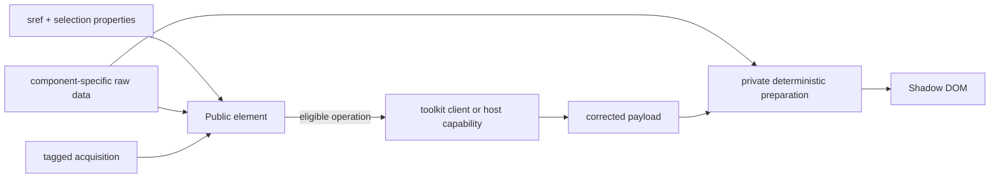

> Created/edited by GitHub Copilot; pending human review.

# Component specification

## Status

The declarative standalone-loading cutover is implemented. All seven public elements accept `sref`. Text Segment, Bilingual Segment, Reference Label, Source Card, Popup, and Connections Panel also accept component-specific raw `data`. Reader accepts raw transactional seeds rather than an ordinary persistent data override.

Unrelated future component slices remain planned where identified in [Development](../development.md).

## Boundary

Each element owns one reactive input snapshot, validates authoritative supplied input or acquires corrected endpoint data, prepares rendering privately, and renders Shadow DOM.

The corrected generated contract is transport authority. Component validation, selection, normalization, and private preparation are rendering authority. Public raw input is not render-ready state.

## Input precedence

For the six non-Reader elements, `data !== undefined` selects supplied mode.

- Valid data makes zero requests.
- Valid empty data remains authoritative.
- Invalid data supersedes pending acquisition, replaces prior content with an accessible validation failure, and never falls through to `sref`.
- Clearing `data` resumes a retained eligible `sref`.
- Clearing `data` and `sref` in one synchronous update yields empty state.

Synchronous writes form one scheduled snapshot. Arrays and objects are replaced rather than mutated in place.

Reader `sref` is the requested root, not the current navigation position. Reader raw source/connections seeds initialize or transactionally replace state. Equal root reassignment is a no-op.

## Raw supplied-data forms

Complete endpoint responses use generated operation/status validators. Narrow selected fragments and response-shaped slices use component-specific validators over only the corrected fields they consume.

Text-bearing components accept response-shaped candidate collections and, where documented, already-selected fragments. Candidate collections retain the evidence required for language, exact-edition, primary, source, or translation selection. Missing selection evidence is distinct from a known no-match.

Text Segment with only `sref` uses the v3 `version=primary` default. Explicit language-family or exact-version selection remains available and reprojects supplied candidate data with zero I/O.

## Acquisition

Each element accepts an optional tagged `SefariaAcquisition`:

- `{ kind: "client", client }`
- `{ kind: "capability", capability }`
- `{ kind: "disabled" }`

An undefined value uses one lazy shared acquisition choice per loaded module instance. Import, supplied-data rendering, and explicit per-element acquisition do not realize it. `configureSefariaAcquisition` can replace the pending choice before first shared use; every later call fails, including an identical value.

Explicit failure, disablement, or an unsupported capability operation never falls through to browser HTTP. The client cache remains the only response cache. Elements add no retry, coalescing, persistence, stale fallback, or second cache.

## Lifecycle and failures

Detached elements start no acquisition. Disconnection aborts or invalidates active work while retaining committed content. Reconnection resumes only the still-eligible interrupted phase with a new operation identity. Reconnecting unchanged completed content makes zero requests. Ordinary network failure is not retried automatically.

Popup preparation is independent of `open`. Visibility alone does not start, restart, or cancel acquisition.

Current validation, projection, acquisition, network, and abort failures become accessible element state and documented component-specific error events. Original causes and structured validation paths remain available where the event contract provides them. Superseded work publishes neither success nor failure and produces no unhandled rejection.

## Public and private API

The root entry registers all seven elements. The DOM-free `./acquisition` entry exposes acquisition configuration and types. Component subpaths expose component-specific raw request/selection types. `./reader` exposes shared raw source qualification, browser data-source construction, resolved-source records, and raw seed types. `./reader-session` remains a supported advanced DOM-free semantic/raw facade.

Prepared rendering types and protocols are private. `./bindings` and `./reader-controller` are retired and absent from supported exports. Elements expose no arbitrary `fetch`, base URL, untyped host, public prepared model, or request-capable child protocol.

Public read-only `status` reports the element's current semantic state. Reader additionally exposes read-only `rootLoading`, `selectedRef`, `currentEntryId`, and `readerError`.

## Composition and action ownership

A composite owns its outer request and privately prepares children from captured parent data. It does not assign child `sref` or trigger child acquisition.

Ten child renderings from one captured response require one outer request and zero child requests.

A parent that owns a child data-changing action prevents the child default and emits one parent semantic action. The current unprevented owner executes once. Presentation-only controls remain local.

## Reader session

`@arithmomaniac/sefaria-web-components/reader-session` is a supported advanced DOM-free semantic/raw facade over immutable Reader navigation.

It owns stable entry and operation identities, selected source position, presentation, exact capture coverage, completion eligibility, history, pins, transactional root replacement, bounded budgets, and raw transitions. Public `entryInfo`, `sourceRecord`, and `connectionsRecord` access plus `ReaderEntryInfo`, `ReaderSourceRecord`, and `ReaderConnectionsRecord` expose semantic identity, effective requests, documented statuses, coverage, and library-owned immutable raw payloads without exposing prepared child rendering or content.

Default retention is 20 entries and 20 MiB of aggregate uniquely retained corrected payload JSON. Durable persistence, Forward, browser URL history, retries, coalescing, stale fallback, and public arbitrary pane management remain outside the contract.

## Reader element

Reader owns ordinary source and links acquisition, source qualification, semantic history, Back, breadcrumbs, local captured-links reprojection, responsive pane presentation, cancellation, stale suppression, private preparation, and error reporting.

The `toolbar-actions` slot is additive. The public parts are `toolbar`, `history`, `source-pane`, and `connections-pane`; child parts are not forwarded.

## Component contracts

### Text Segment

Renders one selected version, direction, safe markup, and footnotes. `vocalizationMode` is presentation-only. Standalone requests use `return_format=default`.

### Bilingual Segment

Resolves primary and translation roles independently from payload evidence. `contentLanguage`, `layout`, `sideOrder`, and `vocalizationMode` are presentation-only. One missing side is partial; two missing sides are empty.

### Reference Label

Resolves canonical English/Hebrew labels and a canonical URL. `labelLanguage` and `linked` are presentation properties. Unresolvable input remains an explicit outcome.

### Source Card

Owns one bounded text collection, heading, aligned role pairs, attribution, positional identity, and optional selection. Scalar, range, spanning, and nested non-spanning responses share one element. `sefaria-source-select` reports the canonical target and original position.

### Popup

Owns a bounded Source Card preview, anchor placement, open state, close behavior, and focus restoration. `open` controls visibility only. `sefaria-popup-close` and `sefaria-popup-error` are public events.

### Connections Panel

Owns grouped connections, stable ordering, bounded 20-entry UI pages, and captured preview states. Category, page, and preview visibility changes over captured data make zero requests. Selection and paging events are composed and keyboard reachable.

### Reader

Owns one source-and-connections workspace plus retained semantic history. Reader actions include Back, breadcrumb activation, pane changes, source selection, connections category/page/selection, preview requests, and explicit chat export.

## Text, direction, and attribution

API HTML passes through `@arithmomaniac/sefaria-text-transform` exactly once before private prepared content reaches rendering. Direction and attribution come from payload data. A validated absolute HTTP(S) source may render as a link; arbitrary source strings do not.

## Accessibility and theming

Elements use open shadow roots, real interactive controls, visible focus, accessible names, semantic status/alert output, keyboard operation, and shared `--sefaria-*` theme properties. Reader exposes only its documented slot and coarse parts.

## Verification

Required tests cover:

- supplied-data zero-I/O and invalid-data supersession
- standalone loading for all seven elements
- shared versus explicit acquisition
- original failure causes and no unhandled rejections
- stale completion suppression
- disconnect/reconnect behavior
- Popup visibility-independent preparation
- supplied/acquired private-preparation equivalence
- Reader raw seed admission and semantic/raw record boundaries
- exact one-parent/zero-child request counts, including ten-child cases
- generated metadata and supported-export staleness

## Completion criteria

This component cutover is complete when the implemented declarations, generated metadata, examples, specifications, and deterministic tests agree on the boundaries above. Broader compatibility coverage remains separately planned.
