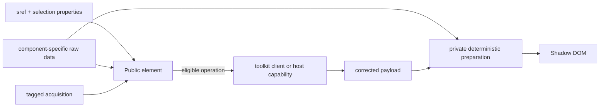

> Created/edited by GitHub Copilot; pending human review.

# Component specification

## Status

The declarative standalone-loading cutover is implemented. All five public elements accept `sref`. Text Segment, Bilingual Segment, Source Card, and Connections Panel also accept component-specific raw `data`. Reader accepts raw transactional seeds rather than an ordinary persistent data override.

Unrelated future component slices remain planned where identified in [Development](../development.md).

## Boundary

Each element owns one reactive input snapshot, validates authoritative supplied input or acquires corrected endpoint data, prepares rendering privately, and renders Shadow DOM.

```mermaid
flowchart LR
    SREF["sref + selection properties"] --> ELEMENT["Public element"]
    DATA["component-specific raw data"] --> ELEMENT
    SOURCE["tagged acquisition"] --> ELEMENT
    ELEMENT -->|"eligible operation"| TRANSPORT["toolkit client or host capability"]
    TRANSPORT --> PAYLOAD["corrected payload"]
    DATA --> PREP["private deterministic preparation"]
    PAYLOAD --> PREP
    PREP --> DOM["Shadow DOM"]
```

The corrected generated contract is transport authority. Component validation, selection, normalization, and private preparation are rendering authority. Public raw input is not render-ready state.

## Input precedence

For the five non-Reader elements, `data !== undefined` selects supplied mode.

- Valid data makes zero requests.
- Valid empty data remains authoritative.
- Invalid data supersedes pending acquisition, replaces prior content with an accessible validation failure, and never falls through to `sref`.
- Clearing `data` resumes a retained eligible `sref`.
- Clearing `data` and `sref` in one synchronous update yields empty state.

Synchronous writes form one scheduled snapshot. Arrays and objects are replaced rather than mutated in place.

Reader `sref` is the requested root, not the current navigation position. Reader raw source/connections seeds initialize or transactionally replace state. Equal root reassignment is a no-op.

## Raw supplied-data forms

Complete endpoint responses use generated operation/status validators. Narrow selected fragments and response-shaped slices use component-specific validators over only the corrected fields they consume.

Text-bearing components accept response-shaped candidate collections and, where documented, already-selected fragments. Candidate collections retain the evidence required for language, exact-edition, primary, source, or translation selection. Missing selection evidence is distinct from a known no-match.

Text Segment with only `sref` uses the v3 `version=primary` default. Explicit language-family or exact-version selection remains available and reprojects supplied candidate data with zero I/O.

## Acquisition

### Language and edition selection

`content-language` selects visible sides, independently of acquisition. Text Segment, Bilingual Segment, Source Card, and Reader accept `translation-language`, a full English language-family name such as `french`. Missing preferences retain the existing default selection. Blank preferences are invalid; family names are trimmed and lowercased before serialization.

Text Segment keeps strict `version-language` and `version-title` inputs. `translation-language` selects its preferred-translation mode and cannot be combined with `version-language`. A title without either language selects `primary|title`. Bilingual Segment, Source Card, and Reader use `primary-version-title` and `translation-version-title`. A translation title combined with a preferred family selects `family|title`; exact titles never silently fall back.

DOM-free Text Segment requests distinguish `version: { language }` from `version: { translationLanguage }`, with an optional `versionTitle` in either form. These are mutually exclusive selections and use the same private preparation as the corresponding element attributes.

Request the preferred language directly: one `version=french` for Text Segment, or `version=primary&version=french` for bilingual content. Only a validated, matching missing-language warning with no contradictory returned candidate allows one further request for Sefaria's default `translation`. That default is not guaranteed to be English. The fallback request includes the primary selector again for bilingual content, so its response remains one complete corrected capture rather than a synthetic merge. A present-but-empty preferred edition remains selected. HTTP, network, abort, validation, and projection failures do not trigger fallback.

Missing-language means warning code 102 for the requested family. An acquired response omitting that family without the warning is an acquisition validation failure, not evidence to use an unrelated returned edition. If the default request reports no translation (warning 104), Text Segment is empty; bilingual content retains a renderable primary side and explicitly reports the absent translation. With neither side renderable, the result is empty.

Selection uses language-family and role evidence, not response position or the legacy `language` field. Supplied data always makes zero requests. If availability metadata advertises a preferred edition whose text is not captured, report missing selection coverage instead of acquiring or substituting a default. A supplied final fallback capture and the same acquired capture produce equal private preparation.

Show actual edition titles and actual languages. Source Card and Reader attribute once per displayed side; standalone Text Segment and Bilingual Segment expose compact attribution with `hide-attributions`. Parent-owned child rendering suppresses repeated attribution privately. A fallback explanation identifies the unavailable preferred family and actual selected language. Never label a French record English merely because its legacy `language` field is `en`.

Reader propagates the preferred family to navigated sources and contextual expansion. Root exact titles apply to that root and its context, not unrelated connection targets. Acquisition selectors participate in request identity, seed admission, retained-source reuse, cancellation, and transactional root replacement. A conflicting supplied seed remains an explicit admission failure, not permission for acquisition.

A connections-only Reader seed captures the element's preferred family for subsequent source navigation without acquiring source text during admission. Invalid selection attributes cancel pending source work before reporting the error, so an ignored-abort response cannot commit a superseded selection or erase that error.

Preferred success, strict editions, and defaults use one outer text request. Missing-language fallback uses at most two, always with zero child requests. Reader's existing target-plus-context qualification may perform two such source operations. Presentation changes and unchanged completed reconnects add no requests. Fallback is component selection, not a client retry or acquisition-source fallback.

These counts describe uninterrupted operations. Disconnection may abort an in-flight request; reconnecting unchanged inputs resumes that request with a new signal, without repeating the completed preferred-language phase. Reader retains its in-flight target qualification while context is interrupted. This operation-local progress is discarded on supersession or completion, not stored as a second response cache.

Connections Panel keeps API-provided links previews without per-link edition acquisition. No Popup language inputs are added.

Each element accepts an optional tagged `SefariaAcquisition`:

- `{ kind: "client", client }`
- `{ kind: "capability", capability }`
- `{ kind: "disabled" }`

An undefined value uses one lazy shared acquisition choice per loaded module instance. Import, supplied-data rendering, and explicit per-element acquisition do not realize it. `configureSefariaAcquisition` can replace the pending choice before first shared use; every later call fails, including an identical value.

Explicit failure, disablement, or an unsupported capability operation never falls through to browser HTTP. The client cache remains the only response cache. Elements add no retry, coalescing, persistence, stale fallback, or second cache.

## Lifecycle and failures

Detached elements start no acquisition. Disconnection aborts or invalidates active work while retaining committed content. Reconnection resumes only the still-eligible interrupted phase with a new operation identity. Reconnecting unchanged completed content makes zero requests. Ordinary network failure is not retried automatically.

Current validation, projection, acquisition, network, and abort failures become accessible element state and documented component-specific error events. Original causes and structured validation paths remain available where the event contract provides them. Superseded work publishes neither success nor failure and produces no unhandled rejection.

## Public and private API

The root entry registers all five elements. The DOM-free `./acquisition` entry exposes acquisition configuration and types. Component subpaths expose component-specific raw request/selection types. `./reader` exposes shared raw source qualification, browser data-source construction, resolved-source records, and raw seed types. `./reader-session` remains a supported advanced DOM-free semantic/raw facade.

Prepared rendering types and protocols are private. `./bindings` and `./reader-controller` are retired and absent from supported exports. Elements expose no arbitrary `fetch`, base URL, untyped host, public prepared model, or request-capable child protocol.

Ordinary browser hosts use attributes for scalar public inputs, including `sref`, enum presentation choices, numbers, strings, and default-false boolean flags. A default-true boolean that must be set false remains a property exception because HTML boolean attributes cannot represent false by presence. Raw `data`, tagged `acquisition`, arrays and other rich values remain property-only. React 19 JSX may express both groups as props because React assigns registered custom-element properties directly.

Public read-only `status` reports the element's current semantic state. Reader additionally exposes read-only `rootLoading`, `selectedRef`, `currentEntryId`, and `readerError`.

## Composition and action ownership

A composite owns its outer request and privately prepares children from captured parent data. It does not assign child `sref` or trigger child acquisition.

Ten child renderings from one captured response require one outer request and zero child requests.

A parent that owns a child data-changing action prevents the child default and emits one parent semantic action. The current unprevented owner executes once. Presentation-only controls remain local.

## Reader session

`@arithmomaniac/sefaria-web-components/reader-session` is a supported advanced DOM-free semantic/raw facade over immutable Reader navigation.

It owns stable entry and operation identities, selected source position, presentation, exact capture coverage, completion eligibility, history, pins, transactional root replacement, bounded budgets, and raw transitions. Public `entryInfo`, `sourceRecord`, and `connectionsRecord` access plus `ReaderEntryInfo`, `ReaderSourceRecord`, and `ReaderConnectionsRecord` expose semantic identity, effective requests, documented statuses, coverage, and library-owned immutable raw payloads without exposing prepared child rendering or content.

Default retention is 20 entries and 20 MiB of aggregate uniquely retained corrected payload JSON. Durable persistence, Forward, browser URL history, retries, coalescing, stale fallback, and public arbitrary pane management remain outside the contract.

## Reader element

Reader owns ordinary source and links acquisition, source qualification, semantic history, Back, breadcrumbs, local captured-links reprojection, responsive pane presentation, cancellation, stale suppression, private preparation, and error reporting.

The `toolbar-actions` slot is additive. The public parts are `toolbar`, `history`, `source-pane`, and `connections-pane`; child parts are not forwarded.

## Component contracts

### Text Segment

Renders one selected version, direction, safe markup, and footnotes. `vocalizationMode` is presentation-only. Standalone requests use `return_format=default`.

### Bilingual Segment

Resolves primary and translation roles independently from payload evidence. `contentLanguage`, `layout`, `sideOrder`, and `vocalizationMode` are presentation-only. One missing side is partial; two missing sides are empty.

### Source Card

Owns one bounded text collection, heading, aligned role pairs, attribution, positional identity, and optional selection. Scalar, range, spanning, and nested non-spanning responses share one element. `sefaria-source-select` reports the canonical target and original position. The heading renders the payload's canonical English `ref` and Hebrew `heRef` through a private template with `lang` and `dir` on each part; it makes no request beyond the card's own text request and exposes no nested element, link, or event.

The former alpha Reference Label element (`<sefaria-ref-label>`, the `./ref-label` subpath, `sefaria-ref-label-error`, and the `resolveReference` acquisition capability member) is removed. Hosts that need a citation link write an ordinary anchor to `https://www.sefaria.org/<url_ref>`; hosts that need text with its heading use Source Card.

### Connections Panel

Owns grouped connections, stable ordering, bounded 20-entry UI pages, and captured preview states. Category, page, and preview visibility changes over captured data make zero requests. Selection and paging events are composed and keyboard reachable.

### Reader

Owns one source-and-connections workspace plus retained semantic history. Reader actions include Back, breadcrumb activation, pane changes, source selection, connections category/page/selection, preview requests, and explicit chat export.

## Text, direction, and attribution

API HTML passes through `@arithmomaniac/sefaria-text-transform` exactly once before private prepared content reaches rendering. Direction and attribution come from payload data. A validated absolute HTTP(S) source may render as a link; arbitrary source strings do not.

## Accessibility and theming

Elements use open shadow roots, real interactive controls, visible focus, accessible names, semantic status/alert output, keyboard operation, and shared `--sefaria-*` theme properties. Reader exposes only its documented slot and coarse parts.

## Verification

Required tests cover:

- supplied-data zero-I/O and invalid-data supersession
- standalone loading for all five elements
- shared versus explicit acquisition
- original failure causes and no unhandled rejections
- stale completion suppression
- disconnect/reconnect behavior
- supplied/acquired private-preparation equivalence
- Reader raw seed admission and semantic/raw record boundaries
- exact one-parent/zero-child request counts, including ten-child cases
- generated metadata and supported-export staleness

## Completion criteria

This component cutover is complete when the implemented declarations, generated metadata, examples, specifications, and deterministic tests agree on the boundaries above. Broader compatibility coverage remains separately planned.
